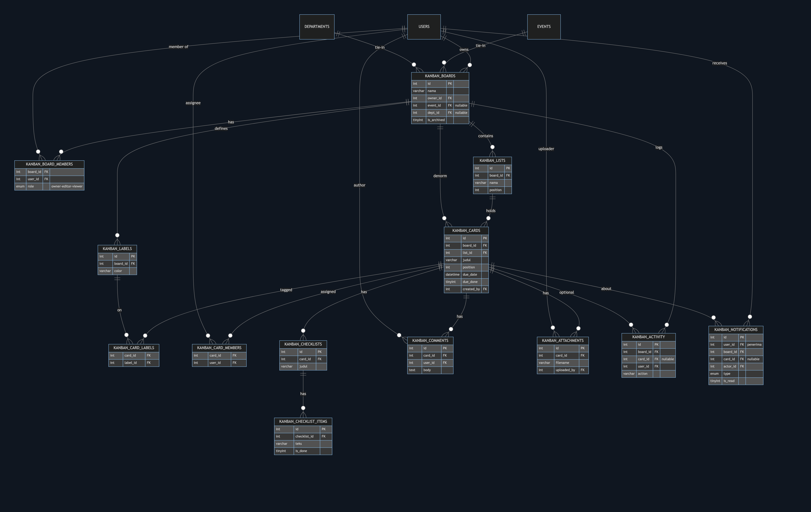
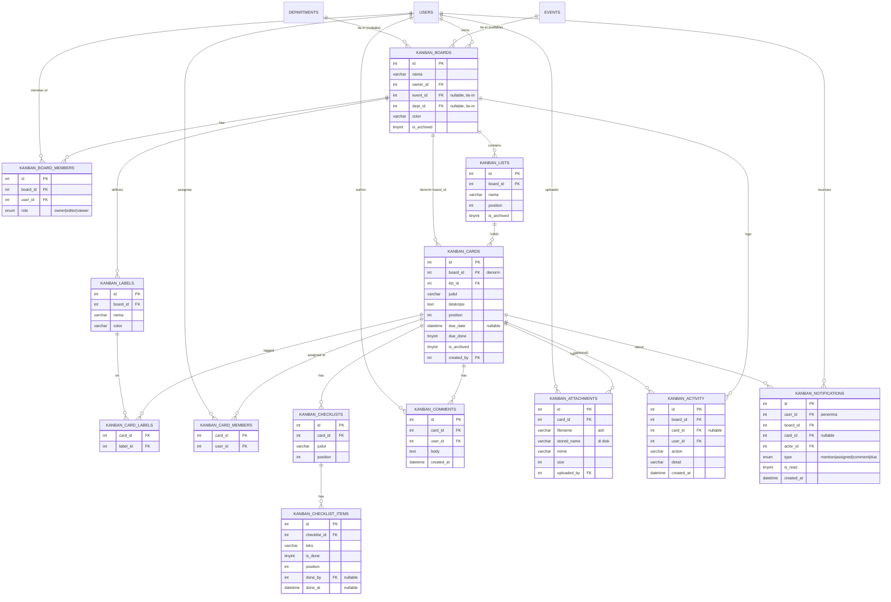

# Desain Modul "Papan" (Kanban / Trello-like) — Mall Intelligence Center

> Status: **DRAFT desain** (belum dikoding). Modul standalone, shared antar-anggota, fitur lengkap ala Trello, dengan tie-in ke event/dept/program kerja di fase lanjut.

---

## 1. Tujuan & Prinsip

- **Standalone**: tiap user/tim membuat board sendiri untuk tugas/project/agenda apa pun.
- **Kolaboratif**: board punya banyak anggota dengan peran berbeda.
- **Nyambung ke MIC (fase 4)**: board bisa ditautkan ke event / departemen / program kerja.
- **Ringan & sesuai stack**: CI4 server-render + Bootstrap 5.3 + **SortableJS** (self-host, tanpa framework JS). Interaksi kartu via `fetch` tanpa reload.
- **Patuh konvensi MIC**: satu controller per modul-besar, ActivityLog di semua mutasi, transaction untuk multi-table delete, `$allowedFields` lengkap, dark-mode (bg gelap + teks terang), responsive.

---

## 2. Model Data (14 tabel)

Semua tabel prefix `kanban_`. Kolom `created_at`/`updated_at` datetime di tabel utama.

### 2.1 `kanban_boards`
| Kolom | Tipe | Ket |
|---|---|---|
| id | INT UNSIGNED PK AI | |
| nama | VARCHAR(150) NOT NULL | |
| deskripsi | TEXT NULL | |
| color | VARCHAR(20) NULL | aksen header/bg (warna solid, bukan foto — ringan) |
| owner_id | INT UNSIGNED NOT NULL | users.id pembuat |
| event_id | INT UNSIGNED NULL | tie-in fase 4 (nullable dari awal) |
| dept_id | INT UNSIGNED NULL | tie-in fase 4 |
| is_archived | TINYINT(1) default 0 | |

### 2.2 `kanban_board_members`
| Kolom | Tipe | Ket |
|---|---|---|
| id | PK AI | |
| board_id | FK → boards | |
| user_id | FK → users | |
| role | ENUM('owner','editor','viewer') default 'editor' | |
| UNIQUE(board_id, user_id) | | owner juga punya baris role=owner |

### 2.3 `kanban_lists` (kolom)
| id PK · board_id FK · nama VARCHAR(120) · position INT · is_archived TINYINT |

### 2.4 `kanban_cards`
| Kolom | Tipe | Ket |
|---|---|---|
| id | PK | |
| board_id | FK | denormalisasi (untuk query & cek akses cepat) |
| list_id | FK | |
| judul | VARCHAR(255) NOT NULL | |
| deskripsi | MEDIUMTEXT NULL | |
| position | INT NOT NULL | urutan dalam list |
| due_date | DATETIME NULL | |
| due_done | TINYINT default 0 | tanda selesai |
| cover_color | VARCHAR(20) NULL | opsional |
| is_archived | TINYINT default 0 | |
| created_by | INT NOT NULL | |
Index: `(list_id, position)`, `(board_id)`, `(due_date)`.

### 2.5 Label
- `kanban_labels`: id · board_id FK · nama VARCHAR(60) NULL · color VARCHAR(20) NOT NULL. (Palet label milik board.)
- `kanban_card_labels`: card_id FK · label_id FK · PK(card_id,label_id).

### 2.6 `kanban_card_members` (multi-assignee)
- card_id FK · user_id FK · PK(card_id,user_id). Assignee wajib anggota board.

### 2.7 Checklist
- `kanban_checklists`: id · card_id FK · judul VARCHAR(150) default 'Checklist' · position INT.
- `kanban_checklist_items`: id · checklist_id FK · teks VARCHAR(255) · is_done TINYINT · position INT · done_by INT NULL · done_at DATETIME NULL.

### 2.8 `kanban_comments`
- id · card_id FK · user_id FK · body TEXT · created_at · updated_at. (Author boleh edit/hapus komentarnya sendiri.)

### 2.9 `kanban_attachments`
- id · card_id FK · filename VARCHAR(255) (nama asli) · stored_name VARCHAR(255) (nama unik di disk) · mime VARCHAR(100) · size INT · uploaded_by · created_at.
- **Disimpan di dir NON-public** (`writable/kanban_uploads/`), diunduh via controller ber-auth (cek keanggotaan board) — lihat §7.

### 2.10 `kanban_activity` (feed aktivitas)
- id · board_id FK · card_id INT NULL · user_id · action VARCHAR(50) · detail VARCHAR(255) · created_at.
- Contoh action: `create_card`, `move_card`, `rename_card`, `set_due`, `complete_due`, `add_member`, `comment`, `add_attachment`, `archive_card`, `create_list`.

> Catatan: `kanban_activity` = feed per-board yang tampil di UI kartu/board. `ActivityLog` global MIC tetap dipanggil terpisah untuk audit (create/update/delete).

### 2.10b `kanban_notifications` (notifikasi & unread)
- id · user_id FK (penerima) · board_id FK · card_id FK NULL · actor_id FK (pemicu) · type ENUM('mention','assigned','comment','due_soon','due_over') · is_read TINYINT default 0 · created_at.
- Index (user_id, is_read). Dibuat saat: **komentar** (→ anggota kartu + user yang di-@mention, kecuali penulis), **assign** (→ user yang di-assign), **due reminder** (cron fase 4).
- Menggerakkan: **badge unread per kartu** (ada notif belum-dibaca utk user ini), **lonceng navbar** (total unread), dashboard **"Kartu Saya"**. Buka kartu → notif kartu itu ditandai `is_read`.

### 2.11 ERD (diagram relasi)



> Sumber Mermaid di bawah (bisa di-render ulang di GitHub / preview VS Code / [mermaid.live](https://mermaid.live)); gambar `kanban-erd.png` = hasil render.



**Cara baca kardinalitas:** `||--o{` = satu-ke-banyak (mis. satu board punya banyak list). Tabel jembatan (`card_labels`, `card_members`) = relasi many-to-many antara kartu ↔ label/user. `USERS`, `EVENTS`, `DEPARTMENTS` = tabel MIC yang sudah ada (bukan bagian modul, hanya direferensikan).

---

## 3. Akses & Peran

**Gate menu**: `canViewMenu('kanban')` — menentukan siapa yang bisa membuka modul sama sekali (via department_menu_access dan/atau user_menu_access per pola MIC).

**Akses board**: user = **owner** ATAU ada di `kanban_board_members`. Helper `boardRole(int $boardId, int $uid): ?string` (null | viewer | editor | owner) dipanggil di **setiap** aksi board/list/card. **Admin sistem (role='admin') bypass — bisa lihat & masuk semua board** (untuk audit/bantuan).

**Kapabilitas per peran:**
| Aksi | viewer | editor | owner |
|---|:--:|:--:|:--:|
| Lihat board, kartu, komentar, lampiran | ✅ | ✅ | ✅ |
| **Berkomentar di kartu** | ✅ | ✅ | ✅ |
| Tambah/geser/edit/arsip kartu, list | ❌ | ✅ | ✅ |
| Checklist, upload lampiran, assign member, tempel label | ❌ | ✅ | ✅ |
| Kelola anggota board & peran | ❌ | ❌ | ✅ |
| Kelola palet label, rename/hapus/arsip board | ❌ | ❌ | ✅ |

> **Viewer = read-only + boleh berkomentar** (cocok utk stakeholder yang memberi masukan tanpa mengubah papan).

**Siapa boleh BUAT board**: **semua** yang punya akses menu `kanban` (fleksibel, seperti Trello).

---

## 4. Controller & Endpoint

Dua controller (ikut konvensi "modul besar dipecah wajar"):
- **`Kanban`** — board-level: daftar board, render board, CRUD board, anggota, palet label, list.
- **`KanbanCard`** — card-level: CRUD/move kartu, detail kartu, checklist, komentar, lampiran, assignee, label kartu.

Peta endpoint (semua `['filter'=>'auth']`):
```
GET  kanban                              Kanban::index          daftar board saya
POST kanban/create                       Kanban::create
GET  kanban/(:num)                       Kanban::board          render board (lists+cards)
POST kanban/(:num)/update                Kanban::update         nama/deskripsi/color
POST kanban/(:num)/archive               Kanban::archive
POST kanban/(:num)/members/add           Kanban::addMember
POST kanban/(:num)/members/(:num)/role   Kanban::setMemberRole
POST kanban/(:num)/members/(:num)/remove Kanban::removeMember
POST kanban/(:num)/labels/save           Kanban::saveLabels     kelola palet label
POST kanban/(:num)/lists/create          Kanban::createList
POST kanban/lists/(:num)/rename          Kanban::renameList
POST kanban/lists/(:num)/archive         Kanban::archiveList
POST kanban/(:num)/lists/reorder         Kanban::reorderLists   {ordered list_ids[]}

POST kanban/lists/(:num)/cards/create    KanbanCard::create
POST kanban/cards/(:num)/move            KanbanCard::move       {list_id, ordered card_ids[]}
GET  kanban/cards/(:num)                 KanbanCard::detail     partial/JSON utk modal
POST kanban/cards/(:num)/update          KanbanCard::update     judul/deskripsi/due/due_done/cover
POST kanban/cards/(:num)/archive         KanbanCard::archive
POST kanban/cards/(:num)/members         KanbanCard::toggleMember
POST kanban/cards/(:num)/labels          KanbanCard::toggleLabel
POST kanban/cards/(:num)/checklists/create        KanbanCard::createChecklist
POST kanban/checklists/(:num)/items/create        KanbanCard::createItem
POST kanban/checklist-items/(:num)/toggle         KanbanCard::toggleItem
POST kanban/cards/(:num)/comments/create          KanbanCard::addComment
POST kanban/comments/(:num)/delete                KanbanCard::deleteComment
POST kanban/cards/(:num)/attachments/upload       KanbanCard::upload
GET  kanban/attachments/(:num)/download           KanbanCard::download   (cek anggota board → stream file)
POST kanban/attachments/(:num)/delete             KanbanCard::deleteAttachment

GET  kanban/(:num)/state                 Kanban::state          snapshot JSON utk polling (versi+data)
GET  kanban/notifications                Kanban::notifications  daftar notif + lonceng
POST kanban/notifications/read           Kanban::markRead       tandai terbaca (per kartu / semua)
```

---

## 5. Drag-Drop & Strategi Posisi

- **SortableJS** dua tingkat: (a) urutkan **kolom** (list) dalam board, (b) urutkan/pindahkan **kartu** dalam & antar-kolom.
- Saat drop, klien kirim **daftar id terurut** dari list tujuan (dan list asal bila lintas-kolom), server set `position = index` dalam **transaction** (reindex). Deterministik, tanpa drift pecahan, murah untuk ukuran board wajar.
- Kenapa reindex, bukan posisi pecahan (fractional)? Skala MIC (puluhan kartu/list) → reindex sederhana & cukup. Fractional = over-engineering.
- Endpoint `move` juga mengubah `list_id` bila lintas-kolom + catat `move_card` ke `kanban_activity`.

### 5.1 Sinkronisasi board bersama (polling ringan)
- Board punya penanda versi murah: `boards.updated_at` (atau kolom `rev` yang di-bump tiap mutasi kartu/list). Klien **polling `GET kanban/{id}/state`** tiap **~10–15 dtk / saat window focus**.
- Jika versi berubah → re-fetch state & **rekonsiliasi DOM** (bukan reload penuh; jangan ganggu kartu yang sedang di-drag/modal terbuka).
- **Konkurensi reorder**: `move` idealnya kirim delta + cek versi board; jika basi (server berubah), klien refresh dulu lalu ulang. Minimal MVP: polling cukup menekan risiko clobber. Tanpa websocket.

---

## 6. Halaman & UX

**6.1 Daftar board (`/kanban`)** — grid kartu board milik/diikuti user, tombol "Board Baru", indikator peran & jumlah anggota. Filter: aktif/arsip.

**6.2 Board (`/kanban/{id}`)** — kolom horizontal (scroll-x, natural kanban; di mobile geser horizontal). Tiap kolom: judul (inline rename), daftar kartu, "Tambah kartu". Kartu ringkas menampilkan: label warna, judul, badge (due, jumlah komentar/lampiran/checklist), **badge merah unread** (ada notif belum-dibaca utk user ini), avatar assignee. Header board: nama, anggota (avatar stack), **filter bar** (label / assignee / due / kata kunci — difilter client-side dari data board yang sudah dimuat), menu (kelola anggota, label, arsip).

**6.3 Modal kartu** (Bootstrap modal, isi via AJAX) — judul (inline edit), deskripsi (textarea, tampil `nl2br`), **Label** (chip toggle dari palet board), **Anggota** (toggle assignee), **Due date** (picker + toggle "selesai"), **Checklist** (progress bar + item centang), **Komentar** (thread, edit/hapus milik sendiri, **@mention** anggota board), **Lampiran** (list, upload/unduh/hapus), **Aktivitas** (feed, collapsible). Membuka kartu menandai notifikasinya terbaca. Tombol Arsip.

**6.4 Notifikasi** — **lonceng di navbar** (total notif belum-dibaca), badge merah per kartu, dashboard **"Kartu Saya"** (kartu ber-assignee = user / punya notif, lintas board, urut due). @mention di komentar → notif ke user tersebut.

**6.5 Dark mode & responsive** — bg gelap + teks terang (hindari konflik Bootstrap dark). Board scroll-x; waspada gotcha iPad portrait (sidebar) — kolom diberi lebar tetap (mis. 280px) + container scroll.

---

## 7. Penyimpanan Lampiran (controller-guarded)

- **Dir NON-public** `writable/kanban_uploads/` (di luar docroot → tak bisa diakses langsung via URL). ⚠️ buat manual + chmod (konvensi upload MIC; `mkdir` PHP gagal di XAMPP ini). Folder tunggal, **hindari subfolder per-board** (tak perlu mkdir runtime).
- Nama disk unik (`stored_name`, mis. `k_{cardId}_{random}.ext`); nama asli di DB (`filename`).
- **Unduh via controller** `GET kanban/attachments/{id}/download` → cek `boardRole` (harus anggota/owner/admin) → `Response` stream file dgn header `Content-Disposition`. Board privat = lampiran benar-benar privat.
- Validasi **mime & ukuran** (maks **10 MB**; tipe: jpg/png/webp, pdf, doc(x)/xls(x)/ppt(x), zip). Hapus file fisik **setelah** commit DB (konvensi transaction MIC).

---

## 8. Integrasi / Tie-in (fase 4)

- Kolom `boards.event_id` & `boards.dept_id` sudah ada sejak awal (nullable). UI tie-in menyusul:
  - Tombol **"Buat papan dari event"** di halaman event → board ter-link (`event_id`).
  - **Board dept: auto-share** — board bertanda `dept_id` otomatis bisa diakses seluruh karyawan dept itu (tanpa undang satu-satu). Akses efektif = anggota eksplisit ∪ karyawan dept terkait.
  - Kartu bisa deep-link ke **program kerja** / **promo media request** (loose coupling: simpan referensi opsional, bukan FK keras).
- Dashboard **"Kartu Saya"**: agregasi kartu ber-assignee = user, lintas board, urut due date.

---

## 9. Konvensi MIC yang Dipatuhi

- **ActivityLog::write** di setiap create/update/delete (board/list/card/komentar/lampiran); tambah label modul (`kanban_board`, `kanban_card`, dst) di `ActivityLog::moduleLabel()`.
- **`$allowedFields`** lengkap di tiap model (gotcha: kolom tak terdaftar diam-diam tak tersimpan).
- **Transaction** untuk hapus berjenjang (hapus board → lists → cards → child → file lampiran setelah commit).
- **Grouping/filter di controller**, bukan view.
- **Menu standalone** key `kanban`, **label tampilan "Boards"**, di **section sidebar baru "Kolaborasi"**: update `SectionConfig` + `$standaloneKeys` di `edit.php` + `department_menu_access` (pola standalone MIC), plus grant per-user via `user_menu_access` bila perlu.
- **CSP**: SortableJS self-host di `public/js/` (bukan CDN).

---

## 10. Rencana Migrasi per Fase

| Fase | Migrasi (tabel) | Fitur |
|---|---|---|
| **1 — Fondasi** | boards, board_members, lists, cards | Akses+peran, daftar board, render board, drag-drop kartu & kolom, CRUD board/list/kartu, **polling sync (§5.1)**, arsip dasar |
| **2 — Kolaborasi & atribut** | labels, card_labels, card_members | Undang anggota + peran, palet label warna, multi-assignee, due date + tanda selesai, **filter bar** |
| **3 — Detail kartu & notif** | checklists, checklist_items, comments, attachments, activity, **notifications** | Modal kartu penuh (checklist, komentar+@mention, lampiran controller-guarded, feed aktivitas), **badge unread + lonceng** |
| **4 — Polish & integrasi** | *(tanpa tabel baru)* | Arsip/restore lengkap, reminder due-date (cron → notif in-app), dashboard "Kartu Saya", tie-in event/dept/program kerja |

Tiap fase = rilis mandiri yang langsung bisa dipakai.

---

## 11. Keputusan Final (TERKUNCI — 9 Juli 2026)

1. **Admin bypass**: ✅ Ya — admin (role='admin') lihat & masuk semua board.
2. **Viewer**: read-only **+ boleh berkomentar** (checklist/lampiran/assign tetap editor+).
3. **Buat board**: **semua** yang punya akses menu `kanban`.
4. **Menu**: label **"Boards"**, di section sidebar baru **"Kolaborasi"** (key internal `kanban`).
5. **Lampiran**: **10 MB**; tipe jpg/png/webp, pdf, doc(x)/xls(x)/ppt(x), zip.
6. **Reminder due-date**: **badge in-app saja** (+ dashboard "Kartu Saya"), tanpa email.
7. **Skala**: puluhan kartu/board → **strategi reindex posisi** (bukan fractional).
8. **Board dept (fase 4)**: **auto-share** ke seluruh karyawan dept terkait.
9. **Sync board bersama**: **polling ringan** (~10–15 dtk / on-focus), tanpa websocket (§5.1).
10. **Lampiran**: **controller-guarded** — dir non-public, unduh via auth controller (§7).
11. **Notifikasi**: **badge unread + @mention** + lonceng navbar (tabel `kanban_notifications`).

> Spec terkunci. Siap mulai **Fase 1** kapan pun.

---

## 12. Adendum — Arsip, Integritas, & Lingkup

### 12.1 Semantik Arsip & Hapus
- **Arsip** (`is_archived=1`) = sembunyikan tapi bisa **restore**; bukan hapus. Arsip **list** → kartunya ikut tersembunyi (tetap ada, ikut restore saat list di-restore).
- **Hapus permanen** (board/list/kartu) = **owner board saja** (admin bypass). Multi-table via transaction; file lampiran dihapus setelah commit.
- Halaman "Arsip" per board untuk lihat/restore/hapus-permanen item terarsip.

### 12.2 Integritas Data (FK)
- Tabel jembatan & anak murni (`card_labels`, `card_members`, `checklist_items`, `card` children) pakai **DB `FOREIGN KEY ... ON DELETE CASCADE`** → anti-orphan otomatis.
- App-level **transaction** tetap dipakai untuk urutan hapus + **hapus file lampiran** (tak bisa via FK).

### 12.3 Di Luar Lingkup (future / tidak sekarang)
- **Pindah kartu antar-board** (kompleks: board_id/label/member beda) — future.
- Cover image kartu, watcher/subscribe kartu, template board, komentar edit-history — skip dulu.
- Real-time websocket — diganti polling (§5.1).
- Reminder due-date via **email** — hanya in-app (bisa ditambah nanti).
